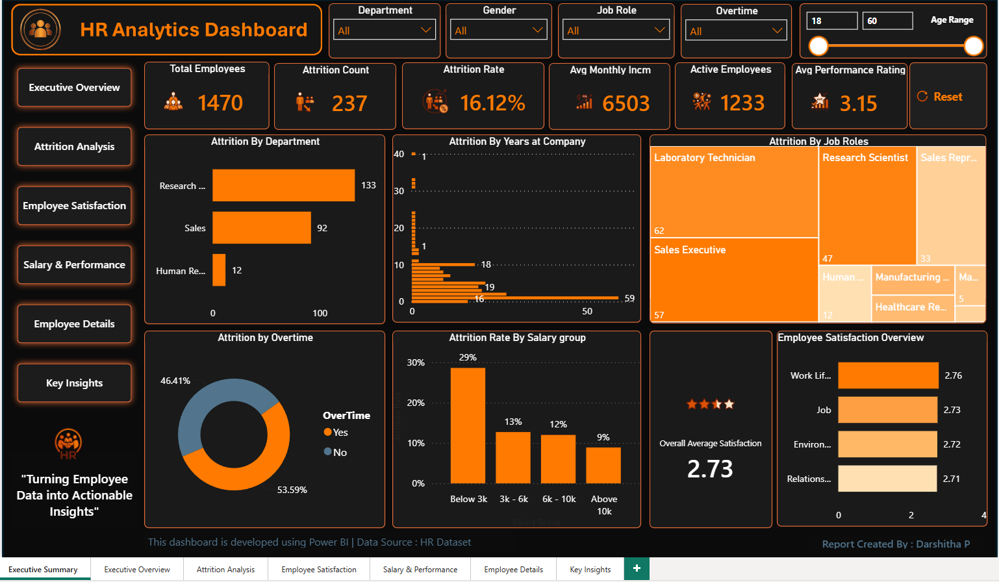
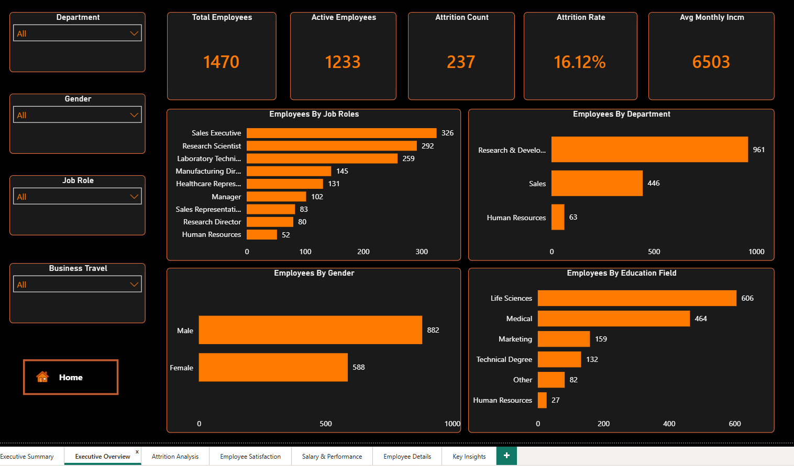
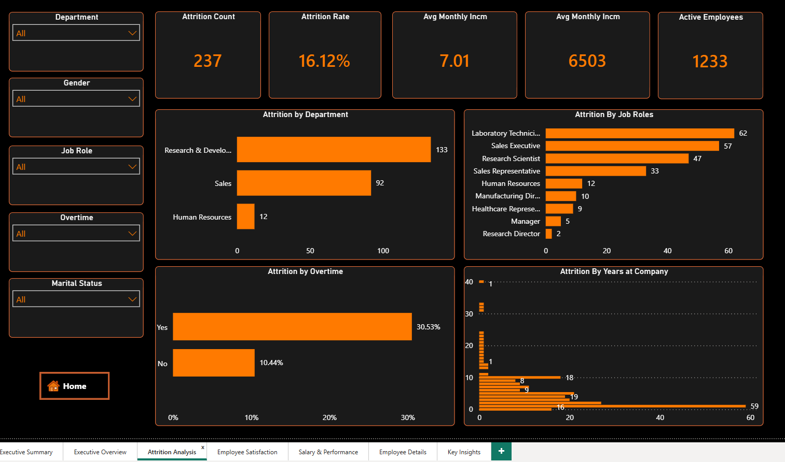
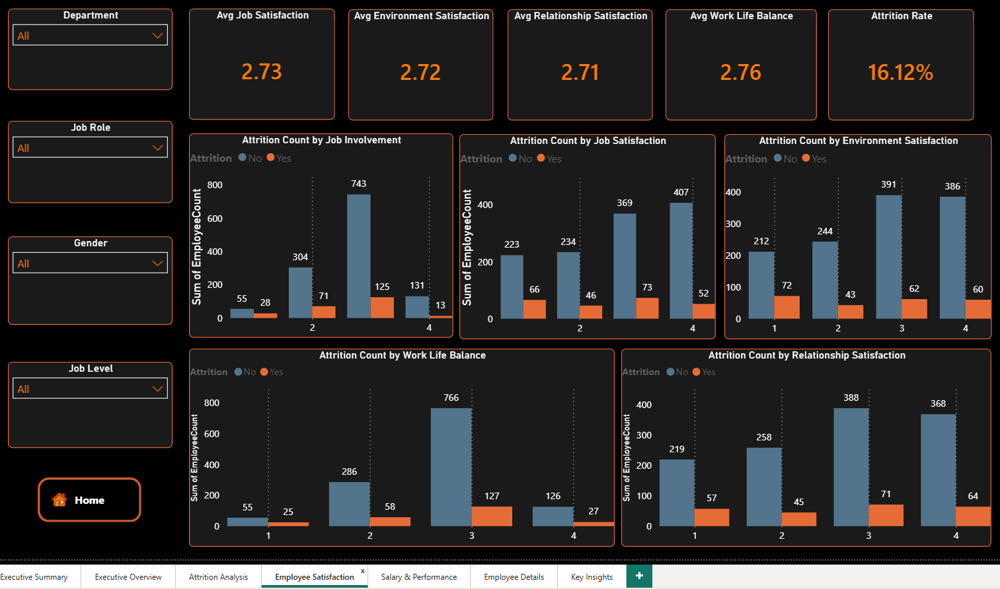
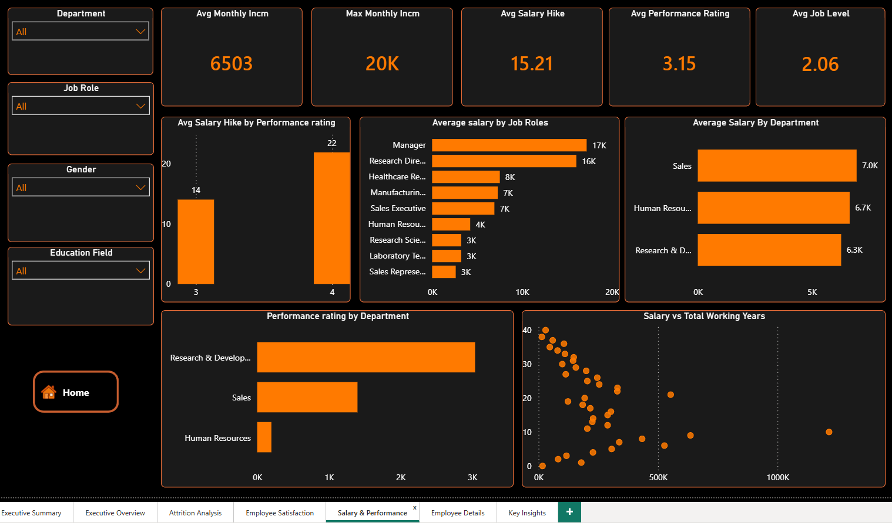
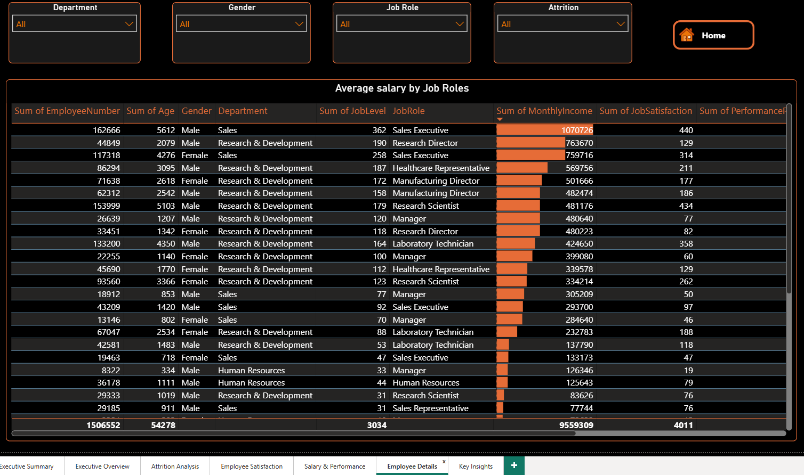
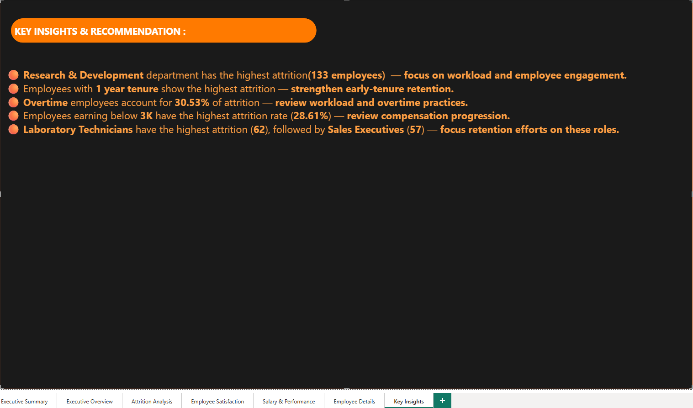

# 📊 HR Analytics Dashboard — Power BI

An interactive **HR Analytics Dashboard** built using **Power BI** to analyze employee attrition, satisfaction, salary, overtime, performance, and workforce trends.

The project transforms HR employee data into actionable insights to help understand **employee attrition patterns and the workforce factors associated with employee turnover**.

---

## 🎯 Project Objective

The main objective of this project is to analyze employee data and identify patterns related to **employee attrition**.

The dashboard helps answer questions such as:

- What is the overall employee attrition rate?
- Which departments and job roles have higher attrition?
- How does employee satisfaction relate to attrition?
- Does overtime affect employee attrition?
- How does salary level relate to attrition?
- Are there differences in attrition between male and female employees?
- How does tenure relate to employee attrition?

---

## 🛠️ Tools & Technologies

- **Power BI** — Dashboard development and data visualization
- **DAX** — Measures, KPIs, and calculations
- **Power Query** — Data transformation and data cleaning
- **Microsoft Excel** — Data source and initial analysis

---

## 📊 Dashboard Pages

### 1. Executive Summary & Recommendations

The main project page providing a high-level view of employee attrition, major findings, and business recommendations.

### 2. Executive Overview

Provides an overall view of key HR KPIs, including:

- Total Employees
- Active Employees
- Attrition Count
- Attrition Rate
- Average Monthly Income
- Average Years at Company

### 3. Attrition Analysis

Analyzes employee attrition across different workforce dimensions, including:

- Department
- Job Role
- Age Group
- Years at Company
- Overtime
- Salary Group

### 4. Employee Satisfaction

Examines employee satisfaction and its relationship with attrition using:

- Job Satisfaction
- Environment Satisfaction
- Work-Life Balance
- Relationship Satisfaction

### 5. Salary & Performance

Analyzes compensation and performance-related factors and their relationship with employee attrition.

### 6. Employee Details

Provides detailed employee-level information for deeper analysis.

### 7. Key Insights

Summarizes the major findings identified throughout the analysis.

---

## 🔍 Key Insights

### 1. Departmental Attrition

The **R&D department** shows a significant level of employee attrition compared with other departments.

### 2. Employee Satisfaction

Employees with a **satisfaction score of 3** represent the highest attrition group in the analysis.

### 3. Tenure

Employees with **1 year at the company account for the highest number of attrition cases** in the analysis.

### 4. Overtime

Employees working overtime have an attrition rate of approximately **30.53%**, indicating a potential relationship between overtime and employee turnover.

### 5. Salary

Employees earning **below 3K** show higher attrition compared with higher salary groups.

### 6. Gender

The analysis shows an attrition rate of approximately:

- **Male:** 17.01%
- **Female:** 14.80%

---

## 💡 Business Recommendations

Based on the analysis, organizations could consider:

- Investigating workload and overtime among employees.
- Improving employee support and engagement during the first year of employment.
- Monitoring employee satisfaction levels and identifying groups with higher attrition.
- Reviewing compensation for lower-paid employee groups.
- Conducting deeper analysis of attrition within high-risk departments and job roles.
- Developing targeted employee retention strategies based on workforce data.

---

## 📸 Dashboard Preview

### Executive Summary & Recommendations

### Executive Overview

### Attrition Analysis

### Employee Satisfaction

### Salary & Performance

### Employee Details

### Key Insights

---

## 📁 Project Files

| File | Description |
|---|---|
| `HR_Analytics_Dashboard.pbix` | Power BI dashboard file |
| `Dashboard_Screenshots/` | Dashboard screenshots |
| `README.md` | Project documentation |

---

## 💼 Skills Demonstrated

- Data Cleaning & Transformation
- Data Modeling
- DAX
- KPI Development
- Data Visualization
- Interactive Dashboard Design
- HR Analytics
- Attrition Analysis
- Business Insight Generation
- Business Recommendations

---

## 📌 Conclusion

This project demonstrates how **Power BI can be used to transform HR data into an interactive analytical solution**, identify employee attrition patterns, and generate data-driven recommendations to support employee retention and workforce decision-making.
